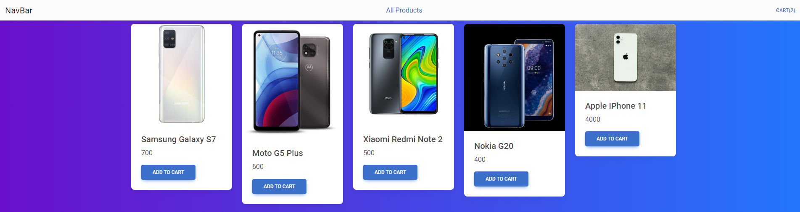
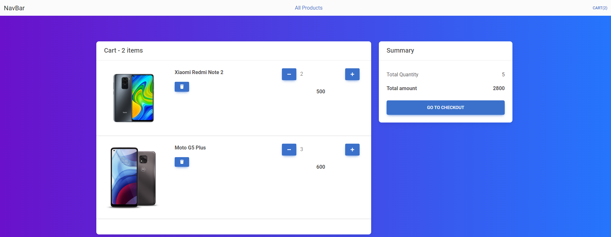

# React Shop template

## Description
The project was created to demonstrate the skills of working with Redux and ReduxTK. In this project, you can add a product to the cart, and in the cart itself, you can edit the quantity of the product, and automatically calculate the order amount.
Also, using ReduxTK and LocalStorage, the data in the cart is saved when the page is refreshed
## Technologies

